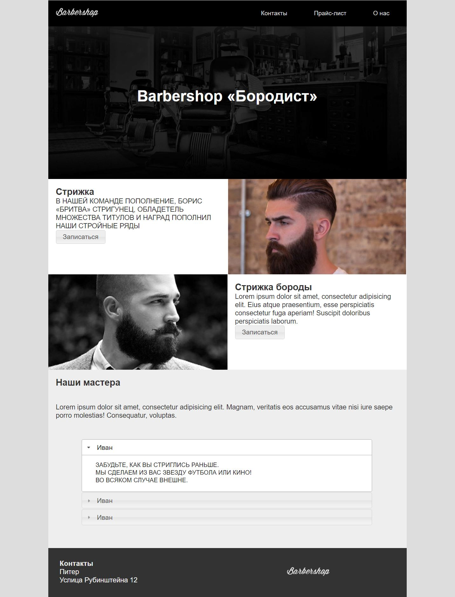

# Барбершоп

## Что?
Сделать страницу по макету.

### Макет


## Как?
Поскольку переходим к CSS фреймворкам, решено было попробовать облегчить себе работу. За основу взят [Tailwind CSS](https://tailwindcss.ru/),который, например,значительно упростил работу с градиентами на кнопках.
Так же базовый сгенерированный CSS содержит резеты всего и вся, включая мерджины, педдинги, заголовки, li, etc.
Из того, чего не было на уроках (или меня не было)использовал свойство [box-sizing](https://doka.guide/css/box-sizing/) со значением `border-box`, благодаря чему удалось поставить картинки с мужиками ровно встык.

### Почему не Bootstrap?
Bootstrap предлагает готовые элементы дизайна, которые хороши для прототипирования,но начинают ужастно мешать при верстке по макету, если не подходят к макету. Tailwind напротив предлагает огромный набор маленьких утилити классов, каждый из которых содержит по одному-два CSS свойству. В дополнение к этому итоговый CSS файл имеет минимальный размер, благодаря тому что в него попадают только те классы, которые были использованы при верстке.

## Сложности 

### Градиенты
Поскольку на макете градиенты четырехкомпонентные (от светлого к темному, от темного к светлому), то делать это руками без переменных очень сложно. Для этого с помошью Tailwind пришлось сделать такой класс:

```css
.gradient {
  background-image: linear-gradient(to bottom, var(--tw-gradient-stops));
  --tw-gradient-from: #cbd5e1;
  --tw-gradient-stops: var(--tw-gradient-from), var(--tw-gradient-to, rgb(203 213 225 / 0));
  --tw-gradient-stops: var(--tw-gradient-from), #f1f5f9, var(--tw-gradient-to, rgb(241 245 249 / 0));
  --tw-gradient-to: #cbd5e1;
}
```

### Аутлайны
У открытых `details` и `summary`  `p` имеют _как бы_ бордеры, но на самом деле сделать это бордерами невозможно.
Поэтому пришлось использовать [outline](https://doka.guide/css/outline/) примерно вот так: 

```css
details>p {
  margin-left: 1rem;
  margin-right: 1rem;
  padding-left: 3rem;
  padding-right: 3rem;
  outline-style: solid;
  outline-width: 1px;
  outline-offset: 1rem;
}
```

### Отступы у буллетов в `summary`
Сделать для буллета отступ с помощью margin или контента невозможно, то есть конструкции вида `summary::before` или `summary::marker` с отступами не помогают. Пришлось в  `summary` вставлять строчный элемент (`span`)  и вешать отступы уже на него. Получилось как-то так:

```css
summary>span {
  padding-left: 1rem;
}
```
